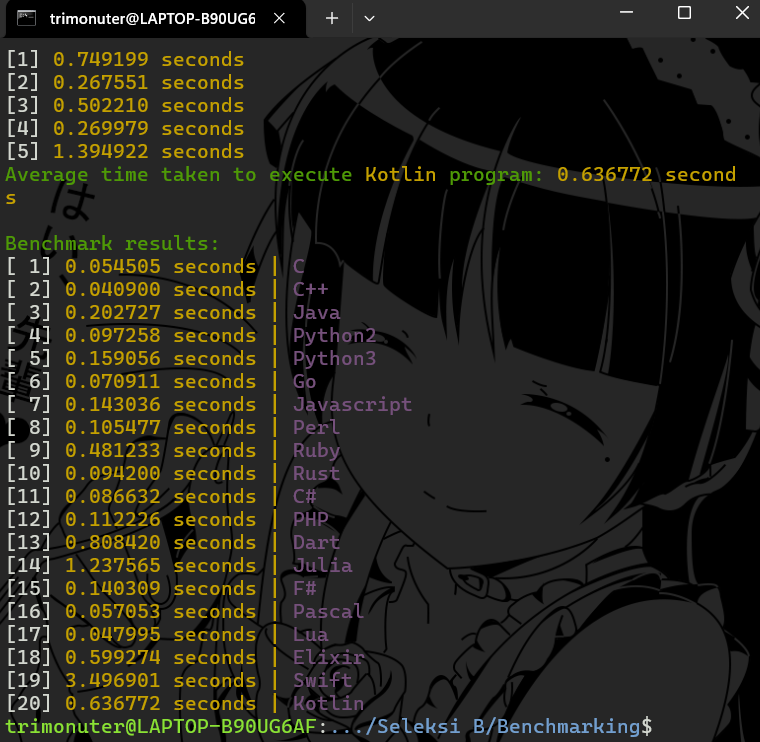
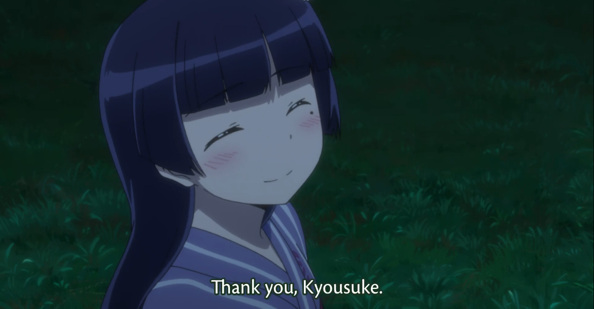

    

# Info
* `./run.sh` untuk menjalankan program
* `./clear.sh` untuk menghapus seluruh hasil output `inverse_matrix.txt`
* Terdapat file [SetupGuide](./_misc/SetupGuide.pdf) untuk panduan setup beberapa bahasa, tapi sebisa mungkin kalo ada yang dependency error di debug ya tolomng 😭😭😭😭😭
* Satu bahasa yang error compile/run bakal error secara lokal aja, bahasa selanjutnya ga terpengaruh

# List Bahasa dan Hasil Benchmarking

# fin.

  <h3><i>last finished <3</i></h3>
  <h3><i>Thank you, thank you, goodnight.</i></h3>
  <h3><i>>pol</i></h3>

