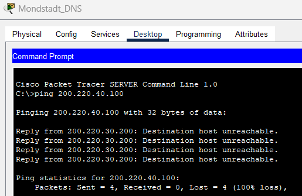

<div style="text-align:center;">
    
</div>

# A. Jaringan Antarnegara


Jaringan utama terdiri atas 5 negara, dengan masing-masing negara memiliki network address-nya masing-masing sebagai berikut:
* **Liyue**: 195.195.0.0/16
* **Sumeru**: 200.200.0.0/16
* **Fontaine**: 200.210.0.0/16
* **Mondstadt**: 200.220.0.0/16
* **Inazuma**: 200.230.0.0/16

Liyue, Sumeru, Fontaine, dan Mondstadt terhubung dengan topologi Ring, sedangkan Inazuma tersabung kepada jaringan melalui router Liyue.

Komunikasi antarnegara dilakukan dengan routing secara manual. Berikut merupakan contoh konfigurasi pada router Sumeru.


Sumeru, Liyue, dan Mondstadt menyimpan seluruh network address negara pada tabel routingnya termasuk network address diri sendiri. 

Fontaine hanya menyimpan tiga address routing, satu untuk diri sendiri, satu untuk ke Sumeru, dan seluruh address lainnya ditujukan ke router Mondstadt. Inazuma hanya memiliki dua address routing, satu untuk diri sendiri, dan address lainnya ditujukan ke router Liyue.

Untuk mendemonstrasikan komunikasi antarnegara, berikut merupakan hasil dari PC dari Fontaine melakukan ping ke DNS Server Inazuma.


# B. Jaringan Negara

Seluruh negara secara umum memiliki 3 jaringan besar, yaitu jaringan user, jaringan spesial, dan jaringan Adventurer's Guild.

Topologi dari luar ke dalam untuk setiap negara kurang lebih seperti berikut:
* Router utama negara tersambung ke DNS server negara ISP router
* ISP router terhubung ke User router dan Special router
* Special router terhubung ke jaringan spesial dan router Adventurer's Guild

## Jaringan User
Router untuk jaringan User dipasang dengan NAT overload dan DHCP, sehingga PC User akan berkomunikasi ke ke luar jaringan menggunaka IP router, dan device dari luar jaringan tidak dapat melakukan ping terhadap PC.

Misal didapatkan router dengan IP dalam 192.168.10.1, dan IP luar 200.230.0.1. Konfigurasi NAT overload untuk router sebagai berikut: 

```
# Tentukan ip nat inside dan ip nat outside
UserRouter(config)# interface GigabitEthernet0/0
UserRouter(config-if)# ip address 192.168.10.1 255.255.255.0
UserRouter(config-if)# ip nat inside
UserRouter(config-if)# no shutdown
UserRouter(config-if)# exit

UserRouter(config)# interface GigabitEthernet0/1
UserRouter(config-if)# ip address 192.168.2.2 255.255.255.252
UserRouter(config-if)# ip nat outside
UserRouter(config-if)# no shutdown
UserRouter(config-if)# exit
```

```
# Tentukan komputer yang akan diberikan akses NAT
UserRouter(config)# access-list 1 permit 192.168.10.0 0.0.0.255

# Pasang NAT overload pada port luar
UserRouter(config)# ip nat inside source list 1 interface GigabitEthernet0/1 overload
```

Lalu untuk pemasangan DHCP
```
# Tentukan excluded-address
Router(config)# ip dhcp excluded-address 192.168.10.1 192.168.10.10
Router(config)# ip dhcp excluded-address 192.168.10.100 192.168.10.110

# Konfigurasi default-gateway, network, dan dns-server
Router(config)# ip dhcp pool USER_POOL
Router(dhcp-config)# network 192.168.10.0 255.255.255.0
Router(dhcp-config)# default-router 192.168.10.1
Router(dhcp-config)# dns-server 192.168.10.2
```

Untuk demonstrasi NAT, berikut merupakan paket pada sebuah router NAT yang dikirim oleh sebuah User PC ke DNS Server.


Terlihat bahwa source IP pada inbound PDU masih berupa private IP address (192.168.3.0), sedangkan source IP pada outbound PDU sudah menggunakan IP router.

## DNS Server

Setiap negara memiliki sebuah DNS server yang menunjuk ke website negara atau ke DNS server lain. Berikut merupakan contoh record yang disimpan pada DNS Server Mondstadt.


Website yang disimpan pada DNS server hanya hello.ms, yang merupakan website negaranya sendiri. Record lain hanya berupa NS yang menunjuk ke A record yang menunjuk ke DNS server negara lain (X.X.10.2).

List website yang dimiliki setiap negara adalah sebagai berikut:

Sumeru
```
hello.su
```

Fontaine
```
hello.ft
```

Mondstadt
```
hello.ms
```

Liyue
```
feiyun.ly
qixing.ly
wangsheng.ly
adv.ly
```

Inazuma
```
kanjou.iz
tenryou.iz
yashiro.iz
```

Berikut merupakan hasil PC Liyue melakukan akses ke hello.ft melalui web browser:


# C. Jaringan Khusus Negara

## 0. Private Host dan Public Host


Hampir setiap negara memiliki sebuah jaringan spesial yang menyimpan kebutuhan negara secara eksternal seperti Web Server dan Email Server, maupun internal seperti Private File Server dan Private PC. Tantangan dari jaringan ini adalah mengkonfigurasi sehingga Web dan Email Server dapat diakses dari luar, sedangkan Private PC dan File Server tidak bisa diakses dari luar.

Cara untuk mengkonfigurasinya adalah menggunakan access-list untuk memblokir seluruh traffic yang menuju ke host private, namun memperbolehkan akses ke host lain yang tidak privat.

Misal pada gambar di atas, kita ingin memblokir akses ke File Server, PC1, PC2, dan PC3 Mondstadt, namun memperbolehkan akses ke Web dan Email Server. Pertama, host privat akan diberikan akses NAT agar memiliki private IP.
```
Router(config)# access-list 10 permit 200.220.40.100
Router(config)# access-list 10 permit 200.220.40.101
Router(config)# access-list 10 permit 200.220.40.102
Router(config)# access-list 10 permit 200.220.40.103
Router(config)# ip nat inside source list 10 int gigabitEthernet 0/1 overload
# Jangan lupa melakukan setting ip nat inside dan ip nat outside
```

Lalu konfigurasi access-list untuk memblokir akses ke host-host tersebut.
```
Router(config)# access-list 100 deny ip any host 200.220.40.100
Router(config)# access-list 100 deny ip any host 200.220.40.101
Router(config)# access-list 100 deny ip any host 200.220.40.102
Router(config)# access-list 100 deny ip any host 200.220.40.103
Router(config)# access-list 100 permit ip any any
Router(config)# int gigabitEthernet 0/1
Router(config-if)# ip access-group 100 in
```

Berikut merupakan demonstrasi DNS server Mondstadt mencoba melakukan ping pada private file server:



## 1. Adventurer's Guild

Adventurer's Guild menugaskan untuk jaringan mereka dipasang di seluruh negara. Untuk kebanyakan negara yang dipasang hanyalah private PC dan private File Server, sehingga implementasi cukup dengan melakukan blokir terhadap seluruh akses dari luar.

Namun ada bonus yang diberikan jika jaringan Adv. Guild dapat diakses HANYA oleh PC milik Adventurer's Guild lainnya, sehingga konfigurasi akan sedikit lebih kompleks. Konfigurasi ini akan lebih lanjut dibahas pada bagian bonus. 

## 2. Jaringan Liyue


Liyue meminta untuk dipasang tiga jaringan khusus, yaitu jaringan Wangsheng Funeral Parlor, jaringan Liyue Qixing, dan jaringan Feiyun Commerce Guild. Masing-masing akan memilki Web dan Email Server yang publik serta File Server dan PC yang privat.

Konfigurasi akses cukup dilakukan sama seperti cara sebelumnya, dengan memblokir akses ke File Server dan PC, dan permit akses ke host lainnya. Berikut merupakan contoh konfigurasi router untuk jaringan Wangsheng Funeral Parlor:


Berikut merupakan usaha untuk melakukan ping terhadap seluruh private file server Liyue:


## 3. VLAN Inazuma


Inazuma meminta untuk dibuatkan 3 jaringan khusus menggunakan VLAN, yaitu jaringan Kanjou, Yashiro, dan Tenryou. Akan dilakukan pembagian VLAN sebagai berikut:

* Kanjou: VLAN 70 (200.230.70.0/24)
* Yashiro: VLAN 80 (200.230.80.0/24)
* Tenryou: VLAN 90 (200.230.90.0/24)

Pertama, perlu dilakukan konfigurasi pada switch utama untuk memiliki port VLAN 70, VLAN 80, dan VLAN 90, dilakukan sebagai berikut:


Lakukan juga konfigurasi tersebut untuk switch masing-masing jaringan.


Lalu kembali ke switch utama, konfigurasi port yang tersambung ke router luar menjadi trunk agar dapat membawa paket dari VLAN 70, 80, dan 90.


Lalu pasang subinterface pada router agar memiliki IP address pada VLAN 70, 80, dan 90.


Terakhir, karena masing-masing jaringan memiliki private host, konfigurasikan access-list pada router untuk memblokir akses ke host-host tersebut seperti biasanya.


Untuk pengecekan, periksa apakah dapat dilakukan komunikasi antar-VLAN dengan melakukan ping ke VLAN 90 dari PC VLAN 80.


# D. Jaringan Bonus

## 1. Konfigurasi VLAN

Inazuma ingin memberikan bonus apabila dikonfigurasikan sedemikian rupa sehingga VLAN 80 dapat mengakses kedua VLAN lainnya, namun tidak sebaliknya.

Untuk melakukan hal ini, perlu dilakukan dua hal:

* Memberikan host VLAN 80 akses ke seluruh host pada VLAN 70 dan VLAN 90
* Memblokir private host masing-masing VLAN dari VLAN lainnya (host publik seperti Web dan Email diasumsikan masih diperbolehkan akses)

Untuk melakukan hal tersebut, cukup konfigurasikan access-list pada port dalam router sebagai berikut:


Pertama, seluruh akses dari host VLAN 80 diperbolehkan terlebih dahulu. Setelah itu, VLAN 70 diblokir dari mengakses private host VLAN 90, dan sebaliknya. Terakhir, blokir seluruh akses dari luar ke private host VLAN 80.

Untuk pengecekan, berikut berturut-turut merupakan ping dari VLAN 80 ke private file server, lalu ping dari VLAN 70 ke private file server.


## 2. Adventurer's Guild

Adv. Guild meminta untuk seluruh jaringan mereka dikonfigurasikan agar PC dari Adv. Guild lain dapat mengakses private file server mereka, namun PC lain tidak bisa melakukannya.

Pada jaringan, seluruh jaringan milik Adventurer's Guild memiliki network address X.X.55.0. Konfigurasikan seluruh router Adv. Guild agar memberikan akses pada host dengan IP tersebut, sedangkan blokir PC lain yang tidak memiliki IP tersebut alias bukan PC milik Adv. Guild.


Berikut merupakan hasil dari PC Adventurer's Guild Mondstadt melakukan ping terhadap File Server Adv. Guild Sumeru.


Lalu berikut merupakan hasil dari DNS Server Sumeru melakukan ping terhadap file server yang sama.


# fin.


<div style="display: flex; flex-direction: column; justify-content: center; align-items: center; margin:0px; padding:0px;">
  <h3><i>Transport, motorways and tramlines, starting and then stopping</i></h3>
  <h3><i>Taking off and landing, the emptiest of feelings</i></h3>
  <h3><i>>pol</i></h3>
</div>