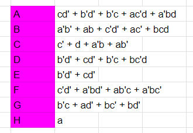
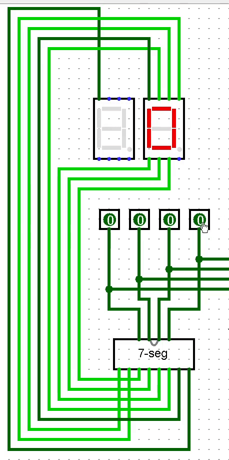

###### computer bad, go outside

# Pendahuluan
Repository ini merupakan dokumentasi terkait perancangan sebuah **komputer 4-bit** sederhana untuk menjumlahkan dua buah angka.

Komputer 4-bit tersebut dibuat menggunakan Logisim. Hasil akhir dapat dilihat pada file `./4bit-computer.circ`.
```
Disclaimer: Ketika membuka file dengan Logisim, terkadang circuitnya bisa ngebug dan kabel-kabelnya menjadi merah dan non-fungsional. Jika mengalami masalah ini, cukup restart ulang Logisim hingga kabel-kabelnya tidak ngebug.
```

# Arsitektur dan Komponen Komputer
Komputer yang dibuat memiliki tiga bagian utama, yaitu:
* **ALU** untuk perhitungan
* **Memory** untuk menyimpan hasil kalkulasi
* **Seven-segment display** untuk menampilkan hasil secara visual

Setiap bagian komputer ini memiliki komponennya masing-masing yang akan dibahas selanjutnya.

## A. ALU


**Arithmetic and Logic Unit (ALU)** merupakan salah satu komponen terpenting pada sebuah komputer, yang memberikan kapabilitas bagi CPU untuk melakukan operasi aritmatika dan logika.

ALU yang dibuat pada simulasi ini cukup sederhana, hanya memiliki input berupa 2 angka 4-bit dan operasi yang ingin dijalankan. Output dari ALU berupa angka 4-bit hasil operasi kedua input angka.

### Half-Adder


**Half-Adder** merupakan salah satu komponen paling sederhana namun sangat sering ditemukan pada sistem digital. Komponen ini dapat dianggap sebagai unit terkecil dalam membuat sebuah alat perhitungan.

Komponen ini menerima 2 input bit, dan akan mengeluarkan 2 output bit berupa **Sum** dan **Carry**. Sum adalah hasil penjumlahan kedua bit, sedangkan Carry merupakan angka yang dibawa ke digit selanjutnya, untuk penjumlahan lebih dari 1-bit.

Output sum merupakan hasil XOR sehingga hanya akan menyala jika hanya salah satu bit bernilai 1, namun tidak keduanya. Sedangkan output carry hanya akan menyala jika kedua bit bernilai 1.

Sebuah Half-Adder secara sendiri tidak terlalu berguna, namun dapat disusun secara banyak dan digunakan pada komponen-komponen yang lebih kompleks.

### Full-Adder


Sebuah Half-Adder hanya dapat digunakan untuk angka 1-bit, karena untuk penjumlahan angka lebih dari 1-bit membutuhkan 3 input, yaitu **bit A**, **bit B**, dan **bit Carry** hasil penjumlahan digit sebelumnya.

Sehingga untuk mengatasi hal ini, dapat dibuat sebuah komponen ekstensi dinamakan **Full-Adder** yang dapat menerima 3 input bit dan mengeluarkan output **Sum** dan **Carry** seperti Half-Adder. Komponen ini tersusun atas **2 buah Half-Adder** dan **1 buah OR gate**, seperti terlihat pada gambar.

### 4-bit Adder


Dengan dibuatnya sebuah **Full-Adder**, kita sekarang dapat menjumlahkan angka yang lebih dari 1-bit. Gambar di atas menunjukkan sebuah **4-bit Adder** untuk melakukan penjumlahan angka 4-bit, komponen yang sangat penting untuk merancang komputer 4-bit kita.

**4-bit Adder** ini sendiri hanya merupakan penjumlahan dua bit yang dilakukan berkali-kali, sehingga dapat memanfaatkan **Half-Adder** dan **Full-Adder** yang sudah dibuat sebelumnya.

Penjumlahan bit paling kanan cukup menggunakan sebuah Half-Adder. Penjumlahan ini akan memiliki **carry** yang diteruskan ke penjumlahan digit selanjutnya menggunakan **Full-Adder**. Sehingga akan dipakai **1 Half-Adder dan 3 Full-Adder** untuk membuat komponen ini.

### 4-bit Sign Switcher


Untuk memfasilitasi operasi pengurangan, diperlukan komponen yang dapat mengkonversi angka positif menjadi angka negatif, sehingga operasi A - B cukup melakukan operasi A + (-B).

Cara konversi dapat menggunakan metode [two's complement](https://en.wikipedia.org/wiki/Two%27s_complement#:~:text=A%20two's%2Dcomplement%20number%20system,the%20corresponding%20power%20of%20two.). Untuk mengubah angka A menjadi -A, seluruh bit 1 akan dirubah menjadi 0 dan sebaliknya. Lalu angka baru tersebut ditambahkan dengan 1.

**4-bit Sign Switcher** pada gambar merupakan komponen yang melakukan hal tersebut. **4 XOR gate** di bawah berfungsi untuk menginversi seluruh bit, dan hasil XOR tersebut akan ditambahkan dengan 1 menggunakan **4-bit adder** di atas.

### Arithmetic and Logic Unit (ALU)


Sehingga dengan dibuatnya **4-bit adder** dan **sign switcher**, dapat dirancang sebuah **ALU** untuk melakukan operasi tambah dan kurang pada dua buah angka 4-bit.

Arsitektur ALU tersebut cukup sederhana, untuk penjumlahan hanya perlu memasukkan dua buah angka ke sebuah **4-bit adder**. 

Untuk dapat melakukan pengurangan, salah satu angka akan dihubungkan ke **4-bit sign switcher** untuk dapat status positif atau negatif angka tersebut. Sebuah **operator switch** di paling kanan berfungsi untuk mengatur status angka ini.

## B. Memory

### Gated D-Latch


Untuk membuat sebuah komponen memori, diperlukan komponen yang dapat menyimpan sebuah data secara permanen. Sebuah **Latch** merupakan komponen tersebut, dan seperti Half-Adder dapat dianggap sebagai unit terkecil dalam memori.

Terdapat banyak jenis latch, namun komputer ini akan menggunakan komponen **Gated D-Latch** yang memiliki input **Data** dan input **Write Enable**, beserta satu buah output yang akan disimpan.

Input **Data** digunakan untuk mengatur nilai bit pada latch, namun untuk dapat mengubah nilai tersebut input **Write Enable** harus dinyalakan terlebih dahulu untuk memperbolehkan modifikasi data.

Setelah nilai Latch ditetapkan, bit Write Enable dapat dimatikan dan nilai tersebut akan tersimpan secara permanen, sampai diganti lagi di masa depan. Merubah nilai pada bit Data saja tidak dapat merubah nilai Latch.

### 4-bit Memory Cell


Setelah dirangkai **D-Latch**, maka dapat dirancang sebuah unit memori yang dapat menyimpan 4-bit sekaligus, yaitu **4-bit Memory Cell**. Secara intuitif, unit ini hanya berupa 4 buah **D-Latch** yang disambungkan ke masing-masing digit input, serta sebuah input **Write Enable** yang tersambung ke seluruh latch.

Namun pada komponen ini, terdapat 3 buah bit Write Enable yang harus menyala sekaligus, yaitu bit **Row**, **Col**, dan bit **Write Enable** sendiri. Alasan ditambahkan input Row dan Col adalah untuk menyusun 16 buah sel-sel ini menjadi sebuah **matriks 4x4** yang berperan sebagai **komponen memori utama komputer**.

### Memory


Berikut merupakan **komponen memori utama** untuk komputer yang akan dirancang. Komponen ini terdiri atas **16 buah sel memori** yang tersusun dalam sebuah **matriks 4x4**. 

Terdapat tiga jenis input pada komponen ini, yaitu **Input Data (4-bit)**, **Address (4-bit)**, dan **Write Enable (1-bit)**. Seperti sebelumnya, terdapat **Input Data** untuk menentukan data yang ingin disimpan, dan **Input Write Enable** untuk menyalakan mode update memori.

Namun jika hanya terdapat dua input tersebut, maka setiap kali Write Enable dinyalakan akan merubah **seluruh** data pada memori, sehingga tidak ada gunanya untuk menyusun 16 sel memori. Sehingga ditambahkan jenis input ketiga, yaitu **Input Address** untuk menentukan sel memori yang ingin dibaca dan dimodifikasi.

**Input Address** ini terbagi menjadi **dua bagian**, yaitu **Input Row (2-bit kiri)** dan **Input Col (2-bit kanan)**, yang menentukan baris dan kolom sel matriks. Terdapat 2^2 kemungkinan Input Row dan 2^2 kemungkinan Input Col, sehingga terdapat **16 kemungkinan address** yang masing-masing terpeta ke satu dan hanya satu sel memori.

Hal ini menyebabkan hanya salah satu sel memori yang akan menyala Input Row, Col, dan Write Enable-nya dalam setiap waktu, sehingga modifikasi data menggunakan Write Enable hanya akan mengubah salah satu sel memori.

## C. Seven-Segment Display

###### visual courtesy of Sebastian Lague from YouTube video: [Visualizing Data with 7-Segment Displays](https://youtu.be/hEDQpqhY2MA?si=NTzBtin7GZi1XKev)

**Seven-Segment Display** merupakan salah satu metode visualisasi komputer yang paling sering ditemukan, terutama pada sisi komputasi yang lebih low-level seperti pada *embedded systems*.

Metode ini menggunakan 7 balok segi-empat (+1 untuk angka negatif) untuk merepresentasikan angka berdigit-satu dari 0-9 (atau -9 sampai 9). Masing-masing balok umumnya adalah sebuah lampu LED yang dapat dinyalakan atau dimatikan. Contohnya, berdasarkan gambar, jika ingin direpresentasikan **angka 3 pada Seven-Segment Display**, maka balok yang dinyalakan adalah **A, B, C, D, dan G**.

Memilih balok yang mana saja yang ingin dinyalakan tentunya mudah, namun kesulitan dari implementasi Seven-Segment Display berada di menentukan sirkuit logika yang cocok agar jika diberikan angka apapun dari 0-9, komponennya mengetahui blok yang mana saja yang harus nyala.


Tabel berikut menunjukkan pemetaan lengkap untuk seluruh digit dari -8 sampai 7 dan blok-blok yang menyala untuk angka tersebut. Karena komputer 4-bit akan memiliki angka negatif, maka angka -9, 8, dan 9 tidak dapat direpresentasikan di komputer sehingga pada tabel ini dihiraukan.

Pada bagian kiri tabel terdapat pemetaan terhadap angka desimal dengan angka biner, dengan keempat bit (a, b, c, d) menyimbolkan 4 bit input kepada komponen Seven-Segment Display.


Tabel berikut merupakan **Peta Karnaugh** yang menggambarkan input mana saja yang membuat balok A menyala dari seluruh kemungkinan input 4-bit (2^4 = 16). **Balok A tidak menyala untuk angka 0001, 0100, 1100, dan 1111**, namun menyala untuk seluruh input lain.

Menggunakan metode **Penyederhanaan Peta Karnaugh** (dapat menggunakan [website seperti ini](https://www.boolean-algebra.com/kmap/)), didapatkan **fungsi aljabar boolean** untuk balok A seperti berikut

```
cd' + b'd' + b'c + ac'd + a'bd
```

Pada aljabar boolean, `'` menandakan NOT, `+` menandakan OR, dan perkalian menandakan AND. Sehingga dapat disusun sirkuit logika untuk balok A seperti berikut:


Dari atas ke bawah:

* AND pertama adalah cd'
* AND kedua adalah b'd'
* AND ketiga adalah b'c
* AND keempat adalah ac'd
* AND kelima adalah a'bd

Lalu hasil dari 5 AND GATE tersebut menjadi input ke sebuah OR GATE.

Menggunakan metode yang sama, dapat dirancang Peta Karnaugh dan sirkuit logika untuk 8 balok A sampai H seperti berikut:



Sehingga masing-masing dapat dibuat komponennya dan digabungkan semua ke dalam satu buah komponen **Seven-Segment Display** seperti berikut:


Komponen ini akan menerima **input sebuah angka 4-bit**, dan mentransformasikannya menjadi **8 output** yang berkorespondensi pada balok-balok pada sebuah Seven-Segment Display.



## D. 4-bit Computer

Ketiga komponen penting untuk sebuah komputer sederhana yaitu **ALU, Memory, dan Seven-Segment Display** sudah berhasil dibuat, sehingga sekarang hanya perlu menggabungkan komponen-komponen ini menjadi sebuah komputer fungsional.


Gambar berikut merupakan hasil akhir dari komputer 4-bit yang sudah dibuat.

* Pada bagian atas terhadap **dua buah input angka 4-bit**.
* Masing-masing input angka terhubung pada sebuah **Seven-Segment Display** untuk masing-masing dan sebuah **ALU** yang digunakan keduanya.
* Di tengah-tengah kedua angka terdapat sebuah **input operator** untuk menentukan operasi yang ingin dilakukan (tambah atau kurang). Jika memilih pengurangan, maka angka di kiri akan dikurangi angka di kanan.
* Output dari ALU terhubung pada sebuah **Seven-Segment Display** untuk memperlihatkan hasil operasi, serta terhubung ke **Input Data** pada komponen **RAM**.
* Pada bagian bawah komputer, terdapat **RAM** yang memiliki input **4-bit Address** untuk menentukan sel memori, **4-bit Data** untuk memasukkan data, dan **1-bit Write Enable** untuk berubah mode dari read/write.
* Komponen RAM juga memiliki **Seven-Segment Display**-nya sendiri untuk menampilkan data yang disimpan.

# Demonstrasi Komputer


[link to video](https://youtube.com/watch?v=iCyJKMQ9m3s)

# fin.


<div style="display: flex; flex-direction: column; justify-content: center; align-items: center; margin:0px; padding:0px;">
  <h3><i>I may be paranoid, but not an android.</i></h3>
  <h3><i>>pol</i></h3>
</div>